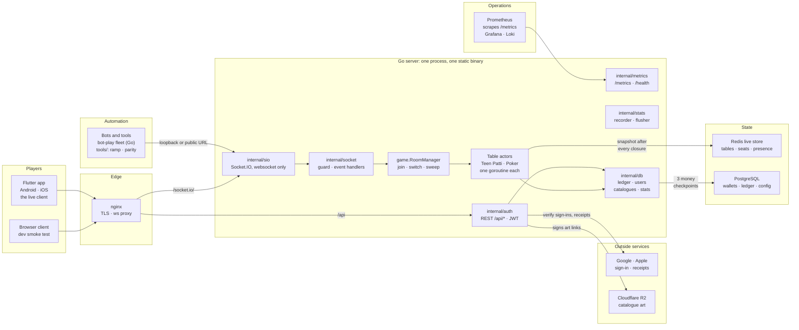
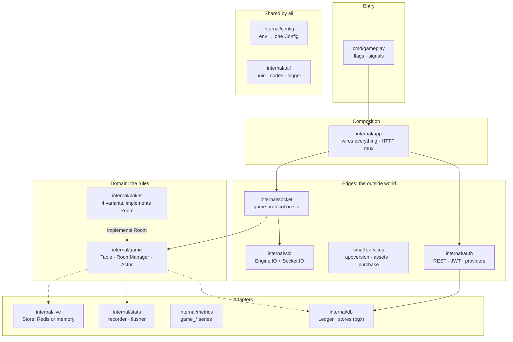
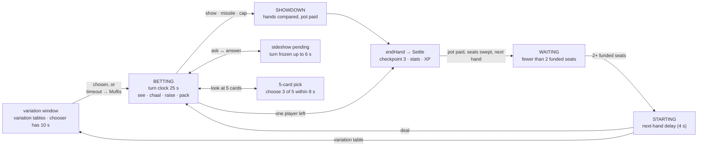
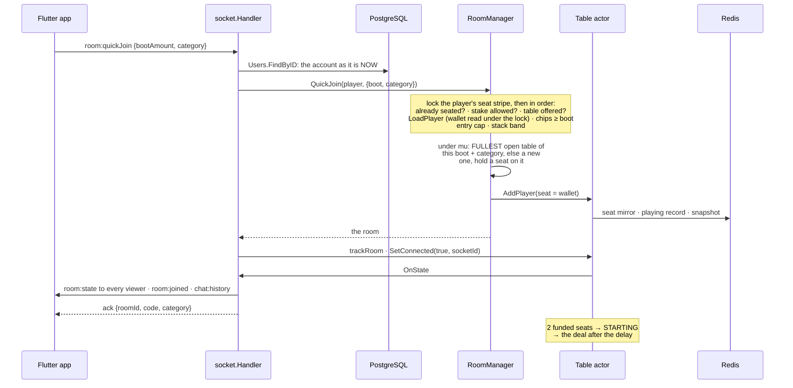
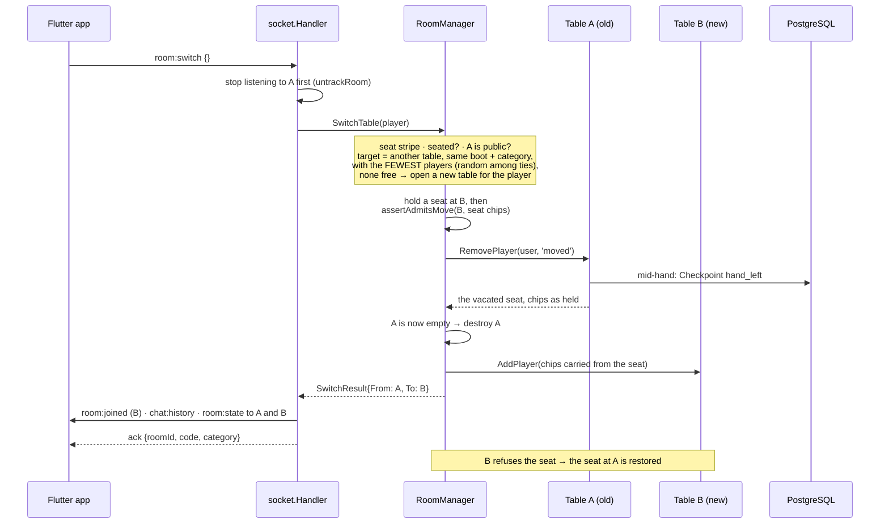
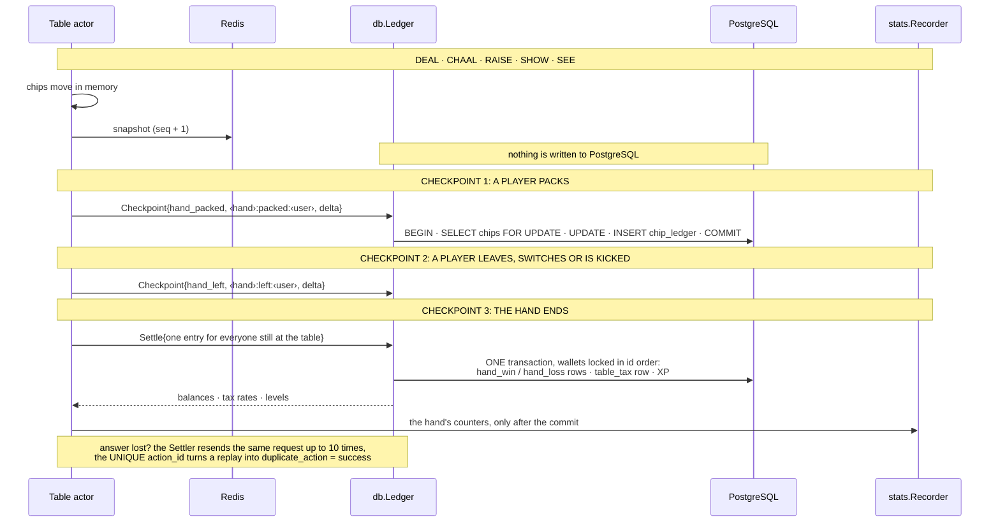
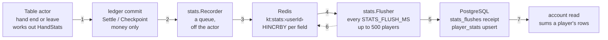
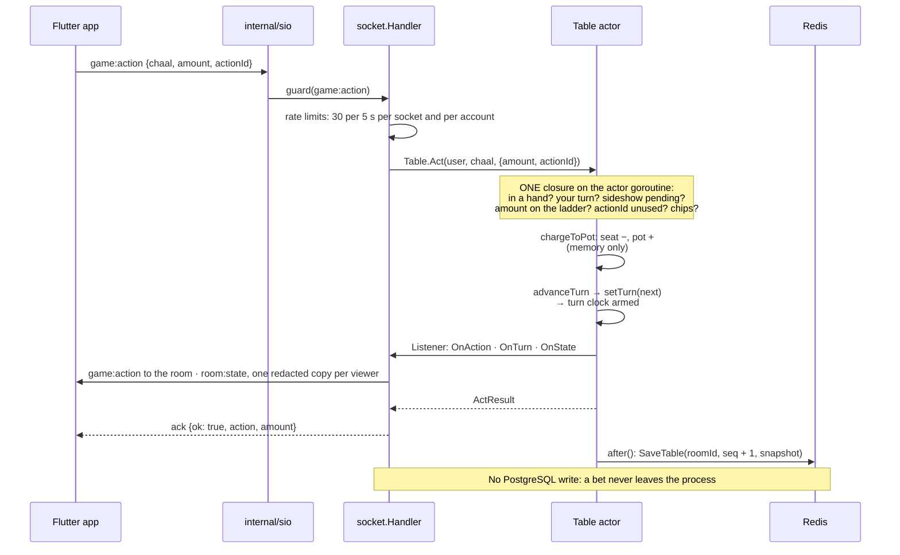
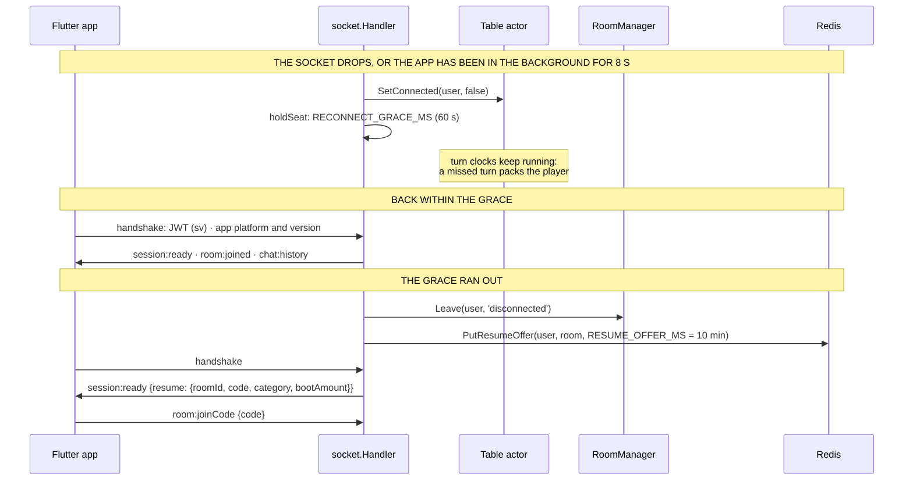

# King Teen Patti — Architecture

<!-- Generated by tools/docs/architecture/build.py: edit the parts there, not this file. -->

How the project is put together: what runs where, how the pieces talk, where state lives, and where each
rule is found in the code. It is written for an engineer who is new to the repository and needs a map
before reading the source.

**Related documents**

| Document | What it is |
|---|---|
| [`docs/architecture.html`](architecture.html) | The same architecture as a page of diagrams, with the key code excerpts. Open it in a browser. |
| [`CLAUDE.md`](../CLAUDE.md) | The exhaustive reference: every rule, every wire field, every trap already hit. This file is the overview; that one is the detail. |
| [`go-server/PORT_PLAN.md`](../go-server/PORT_PLAN.md), [`DECISIONS.md`](../go-server/DECISIONS.md) | How the Go server was ported from the original Node.js one, and every settled ambiguity. |
| [`go-server/PORT_NOTES/specs/spec-socket-protocol.md`](../go-server/PORT_NOTES/specs/spec-socket-protocol.md) | The socket protocol, event by event. |
| [`go-server/ops/DEPLOY.md`](../go-server/ops/DEPLOY.md) | The deploy runbook. |

**Contents**

1. [System at a glance](#1-system-at-a-glance)
2. [Repository map](#2-repository-map)
3. [The Go server](#3-the-go-server)
4. [The game engine](#4-the-game-engine)
5. [Rooms: lobby, join, switch](#5-rooms-lobby-join-switch)
6. [Money](#6-money)
7. [Persistence](#7-persistence)
8. [Network surface](#8-network-surface)
9. [Configuration](#9-configuration)
10. [Observability](#10-observability)
11. [Build, release, deploy](#11-build-release-deploy)
12. [Clients, bots and tools](#12-clients-bots-and-tools)
13. [Testing](#13-testing)
14. [Security model](#14-security-model)
15. [Failure modes](#15-failure-modes)
16. [Where to change things](#16-where-to-change-things)
17. [Glossary](#17-glossary)

---

## 1. System at a glance

King Teen Patti is a turn-based multiplayer card game: Teen Patti (three-card Indian poker) in three
flavours (Seen, Blind, Variation), plus a Poker family (3-Card Poker, 5-Card Draw, Texas Hold'em, Omaha)
that the app hides by default. Players use a Flutter app; one Go process runs every table.



| Part | Path | Role |
|---|---|---|
| Game server | `go-server/` | The only server. Go 1.27, one static binary (`bin/gameplay`). Rules, rooms, Socket.IO, REST, ledger, metrics. |
| Mobile client | `flutter-client/` | The live client (Android shipping, iOS configured). Renders snapshots, forwards intent. |
| Bot fleet | `bot-play/` | Resident bots (Go) that keep production's lobby populated. Ordinary clients of the same protocol, on the game host, over loopback. |
| Tools | `tools/` | Node package: practice bots (`bot.js`), the staged load test (`ramptest.mjs`), the black-box parity suites (`parity/`). |
| Browser client | `go-server/public/` | A zero-build vanilla-JS client used as a protocol smoke test in development. Hidden in production. |
| PostgreSQL | host service | Wallets, the chip ledger, accounts, catalogues, table configuration, statistics. Never the table being played. |
| Redis | host service | The live store: every table's full snapshot, seats, presence, resume offers, statistics waiting to be flushed. |
| Cloudflare R2 | private bucket | The catalogue's art. The server only signs ten-minute download links. |
| Monitoring | `go-server/ops/monitoring/` | Prometheus, Grafana, Loki and Alloy on the game host. |

### Design principles

These five ideas explain most of the code.

1. **The server is the single authority.** It shuffles with `crypto/rand`, deals, validates every bet
   against a ladder it recomputes itself, decides winners, and redacts state per viewer. A client never
   receives a card or a hidden stack it should not see.
2. **Game state lives in Redis; money lives in PostgreSQL.** A table in play is never a database row. The
   wallet is written at three moments of a hand and nowhere else ([§6](#6-money)).
3. **A table is an actor.** One goroutine owns a table; everything that touches it is a closure queued to
   that goroutine. There are no locks inside a table ([§3.3](#33-concurrency-model)).
4. **Every write that can be retried is idempotent.** Moves carry an `actionId`; ledger rows carry a
   UNIQUE `action_id`; statistics batches carry a receipt. A lost acknowledgement never becomes a double
   charge or a double payment.
5. **Configuration is read once.** The process builds one immutable `Config` at boot and passes it down.
   A table copies the figures it plays by when it opens and never reads configuration again.

---

## 2. Repository map

```
king-teenpatti/
├── CLAUDE.md                 the detailed project reference
├── Requirements.txt          the numbered brief (requirements 1–34; code comments cite them)
├── docs/                     this file, architecture.html, iOS and social-login runbooks, load reports
├── go-server/                THE server (module github.com/surajk543/king-teenpatti/go-server)
│   ├── cmd/gameplay/         entry point: main.go, migrate.go (-migrate), tableconfig.go (table-config flags)
│   ├── internal/
│   │   ├── app/              composition: wiring, HTTP mux, /health, static files, start/shutdown
│   │   ├── game/             the domain: Table, RoomManager, Room, Actor, rules, views, errors
│   │   ├── poker/            the Poker family: four variants as rooms
│   │   ├── socket/           the game protocol on Socket.IO: handlers, wire structs, grace, resume
│   │   ├── sio/              our own Engine.IO v4 + Socket.IO v5 server (websocket only)
│   │   ├── auth/             REST routes, JWT, sign-in providers, rate limits
│   │   ├── db/               pgx pool, embedded migrations, every transaction
│   │   ├── live/             the live-store interface: Redis and in-process memory
│   │   ├── stats/            statistics: recorder (Redis) and flusher (group commit)
│   │   ├── appversion/       the app version gate (minimum, latest, maintenance)
│   │   ├── assets/           signs links to the art in R2 (AWS SigV4, standard library only)
│   │   ├── purchase/         Google Play and App Store receipt verification
│   │   ├── config/           environment → one immutable Config; the table catalogue contract
│   │   ├── metrics/          every game_* Prometheus series
│   │   └── util/             uuid, room codes, the JSON logger
│   ├── public/               the browser client, privacy pages, bundled art
│   └── ops/                  build.sh, release.sh, deploy.sh, the systemd unit, monitoring bundle, DEPLOY.md
├── flutter-client/           the app (package `teenpatti`): lib/state, lib/net, lib/screens, lib/widgets
├── bot-play/                 the resident bot fleet (Go, its own module)
└── tools/                    Node package: bot.js, ramptest.mjs, parity/
```

---

## 3. The Go server

### 3.1 Process lifecycle

`cmd/gameplay/main.go` is short: load an optional `.env`, build the config, open the database, build the
app, listen, and wait for a signal.

```mermaid
flowchart LR
  cfg["config.Load<br/>env → one Config<br/>malformed value stops"]
  dbo["db.Open<br/>pool · search_path<br/>every migration, every boot"]
  live["live.Open<br/>Redis or memory<br/>unreachable → fail fast"]
  cat["table catalogue<br/>TABLE_CONFIG_SOURCE<br/>db rows or env keys"]
  wire["stores, sio, handler<br/>RoomManager ↔ socket<br/>XP tracker · stats recorder"]
  restore["restore rooms<br/>Redis snapshots → actors<br/>seats held for the grace"]
  jobs["background jobs<br/>sweeper · reconciler<br/>stats flusher · purge"]
  listen["listen<br/>routes · /health<br/>HOST:PORT"]
  cfg --> dbo
  dbo --> live
  live --> cat
  cat --> wire
  wire --> restore
  restore --> jobs
  jobs --> listen
```



What `app.New` does, in order (the order matters; each step uses the one before it):

1. **Metrics.** Always built, so the counters the other layers touch exist; only exposed when enabled.
2. **The live store.** `live.Open`: Redis when `REDIS_URL` is set (the boot fails fast if it is
   unreachable), otherwise an in-process store.
3. **The table catalogue.** Engines, categories and every lobby table with its figures: from PostgreSQL
   when `TABLE_CONFIG_SOURCE=db`, otherwise composed from the environment keys. It is laid over the
   config once, before anything is built from it. The app version gate's rows are loaded here too.
4. **Stores, tokens, providers.** `db.NewUsers`, the ledger, pictures, emojis, hammers, missiles, the
   Lucky Draw, reward programs, friends; JWT tokens; the Google and Apple verifiers.
5. **The realtime pair.** `socket.New` (the handler) and `game.NewRoomManager` depend on each other: the
   manager emits events the handler broadcasts, the handler calls the manager for every join. They are
   wired together here, with the XP tracker and the statistics recorder.
6. **Late-bound metric sources** (gauges that read the manager and the pool at scrape time).
7. **The restart sequence.** Every table snapshot in the live store is restored as a running actor, the
   sweeper and the live-store reconciler start, and the statistics flusher runs its first pass.
8. **Routes.** REST under `/api`, `/health`, `/metrics`, `/socket.io/`, and the static files.

Database migrations run inside `db.Open`, at every boot. There is no schema-history table: every script
is applied every time, so every script is idempotent. `gameplay -migrate` runs exactly that step and
exits; a deploy runs it before restarting anything.

### 3.2 Packages and layering



- **`internal/game` is the domain.** It holds the rules and does no I/O of its own. It defines the small
  interfaces it needs — `Ledger` (the three checkpoints), `live.Store`, `Clock`, `Listener` (one method
  per table event), `StatsRecorder`, `MissileWallet` — and the packages around it implement them.
- **`internal/app` is the only package that knows every piece.** Nothing but `app` and `cmd` imports
  `socket` or `app`.
- **`game` must not import `metrics`, `db` or `socket`.** Metrics reach it as function hooks
  (`MetricsHooks`); the socket layer reaches it as a `Listener`.
- **No package-level mutable state.** Configuration is passed, not imported. Methods that do I/O take a
  `context.Context` first.
- **Wire types are explicit structs** with JSON tags in the package that produces them, never
  `map[string]any`. Whether a field is `null`, absent or `[]` is part of the protocol.
- **Errors are values with codes.** `game.GameError{Code, Message}` and `auth.AuthError{Code, Message,
  Status}` carry snake_case codes; code is compared, never message text.

### 3.3 Concurrency model

**The table actor.** `game.NewTable` starts one goroutine that owns the table (`actor.go`). Every mutation
and every read of table state is a closure posted with `run(fn)`, which blocks the caller until the
closure has finished.

```go
// go-server/internal/game/actor.go (abridged)
func (a *Actor) Post(fn func(), force bool) error {
	if a.destroyed.Load() || (!force && a.fenced.Load()) {
		return ErrTableDestroyed
	}
	done := make(chan struct{})
	var failure error
	job := func() {
		defer close(done)
		if a.after != nil {
			defer a.after() // Table: flush the snapshot to the live store
		}
		defer func() {
			if r := recover(); r != nil {
				failure = &GameError{Code: CodeInternalError /* … */}
			}
		}()
		fn()
	}
	select {
	case a.posts <- job: // blocked senders are served first-in first-out
	case <-a.ctx.Done():
		return ErrTableDestroyed
	}
	<-done
	return failure
}

func (a *Actor) Loop() {
	for job := range a.posts {
		job()
		if a.destroyed.Load() {
			return
		}
	}
}
```

The rules that follow from it:

| Rule | Why |
|---|---|
| Exported `Table` methods post with `run`; unexported ones never do. | Calling `run` from a closure already on the actor waits on itself: a deadlock. |
| A `Listener` never calls back into its table. | Events are delivered on the actor goroutine. The kick path, which must remove a player, runs in a new goroutine. |
| Timers post closures (`clock.AfterFunc`) and carry a token. | A turn timer that fires after the turn moved finds another token and does nothing. |
| A panic inside one move becomes `internal_error` for that move. | One bad request must not take the table, or the process, down. |
| `PlayerCount`, `IsFull`, `State`, `Version` are atomics. | The RoomManager scans tables while holding its own mutex and must not wait on an actor. |
| After every closure, `LiveState.Flush` saves the snapshot once. | One save per closure, however many events it emitted. |

**The RoomManager** guards only its own maps (`tables`, `playerRooms`, seat holds) with one mutex, and
never holds it while calling a table. Joins reserve the seat in the map first, then call `AddPlayer`.

**Seat-lock stripes.** Each player hashes to one of a fixed set of mutexes (`userLock`). Every door into a
seat and every lobby-only wallet change takes the player's stripe, so a purchase can never land between a
join's wallet read and its seat ([§5.7](#57-seat-locks-and-lobby-only-wallet-changes)).

**The socket layer** never holds its lock while calling a table or emitting.

**The two-owners fence.** Every snapshot is saved under a sequence number with a compare-and-set. If the
store refuses a save as stale, another process owns the table: it is *fenced* — it accepts nothing more
and is torn down without settling a hand it no longer owns.

### 3.4 Shutdown

On SIGTERM the socket server closes first. With Redis, every table is *suspended*: its clocks stop, a
final snapshot is saved, and the next process resumes the hand where it stopped. With the in-process
store every live pot is settled instead (to the first active seat, reason `all_left`), because nothing
would come back. Then the statistics recorder and flusher are drained and the pool is closed. The whole
shutdown has a budget of `max(8 s, PG_STATEMENT_TIMEOUT_MS + 5 s)`.

---

## 4. The game engine

Everything in this section is `go-server/internal/game` unless it says otherwise.

### 4.1 `Room`: what the rest of the server holds

The RoomManager, the socket layer, the sweeper and the restore path hold **rooms** (`room.go`), not
tables. `*game.Table` is the Teen Patti kind and `*poker.Table` the poker kind; `game.AsTable(room)` is
how code that needs the Teen Patti table gets it.

| Group | Methods |
|---|---|
| Identity | `ID`, `Code`, `Category`, `Game`, `IsPrivate`, `BootAmount`, `MaxPot`, `MaxPlayers`, `CreatedAt`, `RulesSpec` |
| Lock-free reads | `PlayerCount`, `IsFull`, `IsEmpty`, `HasHand`, `State`, `Version`, `LiveSeq`, `Fenced`, `Destroyed` |
| Reads on the actor | `ViewFor(viewer)`, `Summary`, `Seats`, `FindSeat`, `ChatHistory`, `ReportContexts` |
| Seats | `AddPlayer`, `RemovePlayer`, `SetConnected`, `SetAvatar`, `CreditChips` |
| Chat | `PostChat`, `PostEmoji` |
| Lifecycle | `SaveLive`, `Settled`, `Destroy`, `Suspend`, `Resume`, `RestoreChat`, `PendingSettlements`, `WaitSettlements` |

A room is opened by the `RoomFactory` registered for its game (`RoomSpec` says what to open, `RoomDeps`
hands it the ledger, the clock, the live store and its hooks). Restoring from Redis reads the snapshot's
first keys (`game`, `roomId`, `createdAt`) and dispatches on `game`.

### 4.2 `Table`: seats and a hand

`table.go` is the Teen Patti rules engine. Its state is two things:

- **Seats** (up to 5): the player's id and name, `chips`, `status` (active, packed, won, lost, sitting
  out), `isBlind`, `blindMoves`, `cards`, `contributed`, `connected`, `missedTurns`, the tax rate and the
  level captured when they sat down.
- **A hand** (nil between hands): `id`, `handNo`, `pot`, `stake`, `round`, `turnSeat`, the turn's
  deadline and token, the pending sideshow, the variation window, and a **contribution record per
  player** — what they put in, the chips they hold, and `chipsWritten`, the chips PostgreSQL last knew.
  That last figure is what every checkpoint's delta is computed from, and because it is in the snapshot
  it survives a restart.

Supporting files: `view.go` (the redacted wire structs), `events.go` (the `Listener` and its payloads),
`snapshot.go` (the full server-side state saved to Redis), `tablespec.go` (a table's config built from a
catalogue row), `table_variation.go`, `table_fivecard.go`, `tabletax.go`, `table_stats.go`.

### 4.3 The life of a hand



- **WAITING → STARTING.** `maybeStart` runs after anything that could make a hand possible. With at
  least two funded seats the table waits `NEXT_HAND_DELAY_MS` (4 s) and deals. A seat that cannot cover
  the boot is held for a grace (`UNFUNDED_GRACE_MS`, 30 s) so the player can buy chips, then shown out.
- **The deal.** Each funded seat pays the boot into the pot, in memory. Three cards each come from a
  52-card deck shuffled with `crypto/rand` (`deck.go`). The dealer button moves every hand; the first to
  act is the player on the dealer's left, and turns go clockwise by seat index.
- **Blind and seen.** Everyone starts blind. `see` is free, allowed off-turn, and does not reset the turn
  clock. After `maxBlindMoves` (4) blind bets a player's cards turn over for them automatically.
- **The ladder** (`betOptions`). The base is the stake for a blind player and twice the stake for a seen
  one; rungs double up to the table's limits, the pot cap and the player's stack. A client amount must be
  exactly a rung (`invalid_bet`). `hand.stake` is kept in blind units.
- **The turn clock.** 25 s. A turn that runs out packs the player and counts a missed turn; at three
  (`maxMissedTurns`) the table emits `kick` with reason `idle`. A successful move, a sideshow answer, or
  choosing a variation clears the count.
- **How a hand ends.**
  - *Last player standing*: everyone else packed.
  - *Show*: exactly two players are left and one pays the chaal to compare.
  - *Forced showdown*: the table's round cap (`maxBetRounds`) or pot cap (`maxPot`) was reached.
  - *Missile*: a player with three or more players still in spends a missile; every hand is shown.
  - *Everyone left*: the pot goes to the last player to leave.

`Table.act` is where every move starts. It applies the checks every move must pass, then dispatches:

```go
// go-server/internal/game/table.go (comments trimmed)
func (t *Table) act(userID string, action Action, req ActRequest) (ActResult, error) {
	if t.hand == nil {
		return ActResult{}, NewGameError(CodeNoHand, MsgNoHand)
	}
	s := t.findSeat(userID)
	if s == nil {
		return ActResult{}, NewGameError(CodeNotSeated, MsgNotSeated)
	}
	if s.status != SeatActive {
		return ActResult{}, NewGameError(CodeNotInHand, MsgNotInHand)
	}
	if action != ActionSee && t.variationPending() {
		return ActResult{}, NewGameError(CodeVariationPending, MsgVariationPending)
	}
	if action != ActionSee && t.hand.turnSeat != s.seatIndex {
		return ActResult{}, NewGameError(CodeNotYourTurn, MsgNotYourTurn)
	}
	if action != ActionSee && t.hand.sideshow != nil {
		return ActResult{}, NewGameError(CodeSideshowPending, MsgSideshowPending)
	}

	var result ActResult
	var err error
	switch action {
	case ActionSee:
		result, err = t.see(s, false)
	case ActionChaal:
		result, err = t.bet(s, BetChaal, req.Amount, req.ActionID)
	case ActionRaise:
		result, err = t.bet(s, BetRaise, req.Amount, req.ActionID)
	case ActionPack:
		result = t.pack(s, PackReasonPack, true)
	case ActionShow:
		result, err = t.show(s, req.ActionID)
	case ActionSideshow:
		result, err = t.requestSideshow(s)
	case ActionForceSideshow:
		result, err = t.forceSideshow(s, req.ActionID)
	case ActionMissile:
		result, err = t.fireMissile(s, req.ActionID)
	default:
		return ActResult{}, Errorf(CodeUnknownAction, MsgUnknownActionFormat, string(action))
	}
	if err != nil {
		return ActResult{}, err
	}
	if action != ActionSee {
		s.missedTurns = 0
	}
	return result, nil
}
```

### 4.4 Sideshow, Force Sideshow, Missile, and ties

- **Sideshow.** A seen player on turn, with at least three players in the hand, may ask the previous
  active player (the one "on their right") to compare privately. The turn clock stops; the asked player
  has 6 s. Accepted: both hands are shown to those two only and the loser packs. Declined or timed out:
  play goes on. It costs nothing, and one may be asked per turn. While a request stands, every move but
  `see` is refused `sideshow_pending`.
- **Force Sideshow.** The same comparison, paid for with a hammer, and it cannot be declined.
- **Missile.** Paid for with a missile, on the firer's turn, with at least three players in. It ends the
  hand: every player still in shows and the best hand takes the pot.

Hands are compared by one function (`Evaluate` / `Compare`, [§4.6](#46-hand-ranking)). Suits never break
a tie, so two hands can be exactly equal. **The pot is never split.**

| Comparison | An exact tie goes |
|---|---|
| Show | against the player who called the show |
| Sideshow, Force Sideshow | against the player who asked |
| Missile | to the player who fired it, when their hand ties for the best |
| Round cap, pot cap, or a tie among other players | to the tied seat nearest the dealer going clockwise, the dealer's own seat first |

### 4.5 Variation tables and 5-Card

On a `variation` table the hand is dealt as usual, then instead of a first turn the table opens a
**variation window**: the player on the dealer's left has `VARIATION_SELECT_TIMEOUT_MS` (10 s) to choose
the hand's variation. While it is open nobody is on turn and every move but `see` is refused
`variation_pending`. The window closes exactly once — by the chooser's pick, by its timer (the server
chooses Muflis), or by the chooser leaving — because all three are closures on the same actor.

The variations: `MUFLIS` (lowest hand wins), `AK47`, `JOKER`, `HUKAM`, `LOWEST_JOKER`, `HIGHEST_JOKER`
(each makes some cards wild), and `FIVE_CARD` (everyone holds five cards and plays three they choose
within 8 s). **There is one ranking, not seven**: `VariationRules` is a wild-card rule plus a comparison
direction laid over the classic `Evaluate`, and its zero value is classic Teen Patti.

### 4.6 Hand ranking

`handrank.go`: `HIGH_CARD < PAIR < COLOR < SEQUENCE < PURE_SEQUENCE < TRAIL`. Among sequences A-K-Q is
highest, then A-2-3, then K-Q-J down to 4-3-2. `Evaluate` scores three cards, `Compare` orders two hands,
`PickWinner` picks among several. An independent oracle test checks all 22,100 three-card hands.

### 4.7 What each player is sent

After every change the table emits `state`, and the socket layer sends each viewer
`serializeFor(viewer)`. There is no room-wide snapshot. The redaction rules:

- `you.cards` only once the viewer has seen their cards; other seats carry only `cardCount`.
- On blind and variation tables, and in poker rooms, other players' `chips` are `null` (never 0) and
  `chipsHidden` is true.
- `you.options`, `you.missedTurns` and `you.taxBps` exist only in the viewer's own `you`.
- A sideshow's cards go to its two players; everyone's cards are public only in a showdown's reveals.
- The full server-side state (`snapshot.go`: every card, every deadline) goes to Redis only, never to a
  client and never to PostgreSQL.

### 4.8 Events

A table never logs and never touches the network. It calls its `Listener` (`events.go`): `OnState`,
`OnHandStarted`, `OnCards`, `OnTurn`, `OnAction`, `OnSideshowRequested`, `OnSideshowReveal`,
`OnSideshowResolved`, `OnVariationSelecting`, `OnVariationSelected`, `OnShowdown`, `OnHandEnded`,
`OnKick`, `OnChat`, `OnPersistError`, `OnError`. The socket handler implements it and turns each into
wire events; the RoomManager wraps it to act on kicks and log refused writes.

### 4.9 The Poker family

`internal/poker` adds four categories as rooms beside the Teen Patti tables: `three_card_poker` (against
a house that qualifies with queen-high), `five_card_draw`, `texas_holdem` and `omaha`. A poker room
implements `game.Room`, is built on the same `Actor` / `LiveState` / `Settler` shell, and banks money at
the same three checkpoints (a fold is `hand_packed`). It has its own evaluator (`eval5.go`), side pots
(`pot.go`), its own wire events (`poker:*`) and its own `Listener`. A `game:*` move sent to a poker room,
or `poker:action` sent to a Teen Patti table, is refused `wrong_game`.

---

## 5. Rooms: lobby, join, switch

`roommanager.go` owns which tables exist, who sits where, and every way into and out of a seat.

### 5.1 The lobby menu and the table catalogue

Every category belongs to one **engine**: `seen`, `blind` and `variation` to `teen_patti`; the four poker
categories to `poker`. A lobby table is a (category, boot) pair with a full set of figures: pot cap,
ladder limits, clocks, stack band, tax. `config.GameConfig.Spec(category, boot, private)` is the one
answer a new table is built from, the lobby card is drawn from, and `GET /api/tables` serves, so the
three can never disagree. A table copies its figures when it opens; an edit to the catalogue reaches only
tables opened after the restart that loads it.

### 5.2 Quick join



| Check, in order | Refusal | Why |
|---|---|---|
| Not already seated | `already_in_room` | One seat per player, whichever door they came in by. |
| Stake is allowed | `invalid_stake` | The boot must be one of the lobby's stakes. |
| Table is on the menu | `table_not_offered` | The category and boot pair must be one the lobby opens. An unknown category folds to `seen`. |
| Wallet read under the lock | `settlement_pending`, `account_disabled` | The seat starts from the wallet PostgreSQL holds now, read while the player's stripe is held. |
| Chips cover the boot | `insufficient_chips` | A poker room asks for its buy-in instead. |
| Stack band | `over_entry_cap`, `below_table_minimum` | A table can be shut to stacks above a maximum or below a minimum. |

```go
// go-server/internal/game/roommanager.go (abridged)
func (rm *RoomManager) QuickJoin(user Player, opts QuickJoinOptions) (Room, error) {
	ul := rm.userLock(user.ID) // the player's seat stripe, held from the first check
	ul.Lock()
	defer ul.Unlock()

	if err := rm.assertNotSeated(user.ID); err != nil {
		return nil, err
	}
	bootAmount := opts.BootAmount
	if err := rm.AssertStakeAllowed(bootAmount); err != nil {
		return nil, err
	}
	resolved := NormalizeCategory(opts.Category)
	if err := rm.AssertTableOffered(bootAmount, resolved); err != nil {
		return nil, err
	}
	user, err := rm.freshPlayer(user) // the wallet as it stands under that lock
	if err != nil {
		return nil, err
	}
	if user.Chips < bootAmount {
		return nil, NewGameError(CodeInsufficientChips, msgInsufficientToJoin)
	}
	// … assertUnderEntryCap, assertWithinTableBand

	for attempt := 0; ; attempt++ {
		started := time.Now()
		rm.mu.Lock()
		// … seated meanwhile → already_in_room
		table := rm.pickTableLocked(bootAmount, resolved, "")
		created := table == nil
		if created {
			table = rm.newTableLocked(CreateTableOptions{BootAmount: bootAmount, Category: string(resolved)})
		}
		rm.holdLocked(table) // the seat is held before the lock is released
		rm.mu.Unlock()

		if created {
			rm.announceCreated(table, started)
		}
		err := rm.seatHeld(table, user, "")
		if err == nil {
			return table, nil
		}
		// … a table opened for this join is destroyed again;
		//   a table torn down under us is picked again
		return nil, err
	}
}
```

- **Which table.** `pickTableLocked` takes the *fullest* public, non-full, non-draining table of that
  boot and category (ties: the oldest). A player arriving should find a game.
- **No race for the last seat.** The pick and the seat hold are one critical section, so fifty players
  joining at once are routed by the seats that will be taken.
- **Then the socket layer** (`socket.Handler.quickJoin` → `seatSocket`) tracks the socket in the room,
  calls `SetConnected(true, socketId)` (which emits state to every viewer), sends `room:joined` with the
  joiner's own snapshot, then `chat:history`, then the ack.

### 5.3 Join by code, create

- **`room:joinCode`** takes exactly 8 letters or digits (`invalid_room_code` otherwise, before any
  lookup). It skips the menu checks — any live table can be joined by its code — and skips the stack band
  for a private table, where the player was invited. Refusals: `room_not_found`, `table_full`,
  `insufficient_chips`.
- **`room:create`** opens a private table at the private boot, from the private template of its
  category. A category with no active template folds to `seen`.

### 5.4 Switch table



`RoomManager.SwitchTable`, by its decisions:

1. Take the player's stripe. Not seated → `not_in_room`. A private table → `private_table`.
2. **Target**: `pickEmptiestTableLocked` — another public table of the same boot and category with the
   *fewest* players, ties drawn with `crypto/rand`. If every other table is full or there is none, a new
   table is opened for the player (unless the lobby no longer opens that pair: `no_other_table`).
3. Hold a seat at the target while still under the manager's lock.
4. `assertAdmitsMove(target, seat chips)`: the seat must cover the target's boot or a poker room's
   buy-in. This is checked **before** the seat is given up. The entry cap and the stack band are not
   applied: those decide who may sit down from the lobby, not who may move sideways.
5. `vacateSeat(user, "moved")`. Mid-hand this is a pack and checkpoint 2: the stake is banked as lost.
   "moved" (not "left") keeps the departure from triggering a consolidation.
6. **The chips travel with the seat.** The player is re-seated with what the vacated seat held, not with
   the wallet figure read earlier — that figure is stale by exactly the stake just banked.
7. If the old table is now empty, destroy it.
8. `seatHeld(target)`. If it is refused, the seat at the old table is restored and a table opened for
   the switch is closed again.

The socket handler stops listening to the old room *before* the switch (leaving can destroy the room,
and "room closed" must not reach a player who is mid-move), then listens to exactly the table the result
names, sends `room:joined`, and broadcasts state to both tables.

### 5.5 Leaving, kicks, unfunded seats

- **Leave** mid-hand is a pack plus checkpoint 2. The stake stays in the pot.
- **Idle kick.** The table only *emits* `kick`; the RoomManager's hook removes the player in a goroutine
  of its own and tells the socket layer (`room:kicked {reason, message}`).
- **Unfunded.** `sweepUnfunded` runs between hands. A seat short of the boot gets `unfundedDeadline` and
  is removed when it passes; `CreditChips` (a chip pack bought at the table) lifts it.

### 5.6 Consolidation, sweeping, draining

- **Consolidation** (`ConsolidateTables`, every `CONSOLIDATE_INTERVAL_MS` = 15 s): lone players waiting
  on idle public tables of the same category and boot are moved onto the oldest such table, so two
  people waiting alone meet. A move needs a stack that covers the target's boot.
- **Sweeping** (`SweepEmptyTables`): a table that has stood empty for 30 s is destroyed.
- **Draining.** A table restored from Redis keeps the rules frozen in its snapshot. If its pair has left
  the menu, or its rules differ from what the catalogue now says, it is marked draining: it plays on and
  can still be joined by code, but quick join, switch and consolidation never send anyone to it.

### 5.7 Seat locks and lobby-only wallet changes

A seated player's chips may change only at the three checkpoints. To make that true, every lobby-only
wallet change — a chip-priced picture, the Lucky Draw, the six-hour bonus, a reward-program claim,
account deletion — runs inside `RoomManager.WhileUnseated(userID, fn)`: it takes the player's stripe,
answers false (the caller returns `409 seated`) if they are seated or their last hand is still being
settled, and otherwise runs the work while holding the stripe. Every join reads the wallet under the same
stripe, so the two can never interleave. A chip pack bought at a table is the exception by design:
`CreditBoughtChips` credits the database and tops up the seat together.

---

## 6. Money

### 6.1 Three checkpoints

All game state lives in Redis. PostgreSQL holds money and audit: the wallet (`users.chips`) and every
movement (`chip_ledger`). A bet is **not** a database transaction, and neither is the deal. The wallet is
brought up to date at exactly three moments, each taking that player's chips as the live table has them.



| Moment | `reason` | `action_id` | Who is written |
|---|---|---|---|
| A player **packs** | `hand_packed` | `<handId>:packed:<userId>` | that player |
| A player **leaves**, switches or is kicked | `hand_left` | `<handId>:left:<userId>` | that player |
| The **hand ends** | `hand_win` / `hand_loss` | `<handId>:settle:<userId>` | everyone still at the table |
| The winner's tax | `table_tax` | `<handId>:tax:<userId>` | the winner, in the hand-end transaction |
| The deal, chaal, raise, show, see | — | — | nothing is written |

### 6.2 A bet, and a checkpoint

A bet is a few assignments on the actor (`Table.chargeToPot`): refuse a repeated `actionId`
(`duplicate_action`) or a short stack (`insufficient_chips`); then `seat.chips -= amount`,
`seat.contributed += amount`, `hand.pot += amount`, and the player's contribution record is updated. The
snapshot goes to Redis when the closure ends.

A checkpoint is one transaction per player (`db/ledger.go`):

```go
// go-server/internal/db/ledger.go (comments trimmed)
func applyCheckpoint(ctx context.Context, tx pgx.Tx, entry game.SettleEntry, handID string, at int64) (int64, error) {
	chips, err := lockWallet(ctx, tx, entry.UserID) // SELECT chips … FOR UPDATE
	if err != nil {
		// … a deleted account is skipped, not failed
		return 0, err
	}

	balance := chips + entry.Delta // a DELTA on the wallet as it is now, never an absolute
	if balance < 0 {
		balance = 0
	}
	if _, err := tx.Exec(ctx, `UPDATE users SET chips = $1, updated_at = $2 WHERE id = $3`,
		balance, at, entry.UserID); err != nil {
		return 0, err
	}

	// One ledger row per player per checkpoint; a taxed win is two rows:
	// the win gross, then the tax.
	rows := game.LedgerRows(handID, entry)
	after := balance - entry.Delta
	for _, row := range rows {
		after += row.Delta
		if err := appendLedgerFor(ctx, tx, row.UserID, handID, row.ActionID, row.Delta, after, row.Reason, at,
			string(row.Game), string(row.Variant)); err != nil {
			return 0, err
		}
	}
	return balance, nil
}
```

The hand end (`Ledger.Settle`) is **one** transaction for everyone still at the table: every entry goes
through `applyCheckpoint` in ascending user id order (so two tables sharing a player cannot deadlock),
then the same transaction awards the hand's XP and moves the one-time missions, and reads back each
player's standing (level, tax rate).

### 6.3 Why it is safe

- **Deltas, never absolutes.** `delta = seat chips now − chipsWritten`. A reward or purchase that credited
  the wallet meanwhile is never overwritten.
- **`chip_ledger.action_id` is UNIQUE, and that is a mechanism.** `endHand` pays the winner in memory
  first (the hand *is* over), then calls `Settle`. If the write fails, or commits and its answer is lost,
  the `Settler` resends the identical request up to 10 times with backoff. A replay hits the unique
  index, the whole transaction rolls back, and the table reads `duplicate_action` as the success it is.
- **Resolve once, record twice.** A player who packed gets `hand_packed` when the money moves and a
  zero-delta `hand_loss` at the hand end, which records the outcome.
- **The ledger is append-only.** A trigger refuses UPDATE and DELETE. The purge job
  (`LEDGER_PURGE_INTERVAL_MS`) removes hand rows older than ten minutes inside its own guarded
  transaction; purchases, bonuses, taxes and rows of a reported hand are never purged.
- **Losing Redis loses the hands, and that is accepted.** Nothing is reconstructed. A player keeps what
  PostgreSQL last knew; chips already staked in an interrupted hand are un-made. Chips can be lost that
  way, never created.

### 6.4 The winning tax

At a table that taxes its winners (every public Seen, Blind and Variation table; never a private table
or a poker room) the one winner pays their rate on their **winnings** — the pot less their own
contribution — when those winnings reach the table's floor (50 Lakh by default). The rate is the lowest
of the player's level rate (20% at Level 1 down to 6% at Level 50) and the rates of the badges they hold;
it is captured when a seat sits down and refreshed by every settle. The seat is credited the pot less the
tax; the ledger writes the win gross and the tax as its own `table_tax` row, so a hand's `hand_*` rows
still sum to zero. What each player has paid is kept as a statistic
([§7.3](#73-statistics-redis-first-then-one-group-commit)).

### 6.5 Other wallets and purchases

Diamonds, hammers and missiles are columns on `users` and are **not** ledgered; each purchase or spend
has its own replay-guard table keyed on the store's token or the action id. Chip packs go through
`chip_ledger` (`purchase`, `action_id = gplay:<token>` or `appstore:<transactionId>`). Google Play
purchases are verified with Google; App Store transactions are verified offline against Apple's root
certificate. A purchase is credited at most once however often the client resends it.

### 6.6 The invariant

```sql
-- expect 0: every wallet equals the sum of its ledger rows
select count(*) from users u
  join (select user_id, sum(delta) s from chip_ledger group by user_id) l on l.user_id = u.id
 where l.s <> u.chips;
```

(Exact for accounts the purge has not touched; across a hand its rows sum to zero, apart from the tax.)

---

## 7. Persistence

### 7.1 PostgreSQL

Forty-four tables, none of them game state.

| Group | Tables |
|---|---|
| Accounts | `users`, `user_sessions`, `user_milestones` |
| Money | `chip_ledger`, `diamond_purchases`, `hammer_purchases`, `hammer_spends`, `missile_purchases`, `missile_spends`, `badge_purchases` |
| Catalogues and ownership | `profile_pictures`, `user_profile_pictures`, `table_pictures`, `user_table_pictures`, `user_table_choice`, `emojis`, `user_emojis` |
| Table configuration | `table_engines`, `table_categories`, `table_settings`, `table_configs` |
| Statistics | `player_stats`, `player_variation_stats`, `stats_flushes` |
| Progression | `player_levels`, `badges`, `user_badges`, `xp_sources`, `xp_settings`, `player_xp`, `player_xp_claims`, `player_xp_missions` |
| Rewards | `lucky_draws`, `lucky_draw_slots`, `user_lucky_draws`, `welcome_rewards`, `reward_programs`, `reward_program_rewards`, `user_reward_claims`, `user_reward_progress` |
| Social | `friend_requests`, `friendships`, `player_reports` |
| Operations | `app_versions` |

Things worth knowing:

- **`users` rows are never deleted** (a trigger refuses it). Deleting an account empties and
  pseudonymises the row; the wallet is emptied through an `account_deleted` ledger row.
- **Migrations** are embedded in the binary (`internal/db/migration/`): `V1.0.0__baseline.sql` holds all
  structure, `V1.0.1__seed.sql` the rows, and later files may hold rows only. Every script runs at every
  boot, so each is idempotent. A new column is written twice — in its `CREATE TABLE` and in a
  catalogue-guarded `DO` block that adds it to a database built before it — and never with
  `ADD COLUMN IF NOT EXISTS`, which takes an exclusive lock even when the column exists.
- **`search_path`** is set as a connection parameter, so tests and the parity harness run on throwaway
  schemas of the same database.
- **Timestamps** are epoch milliseconds (`BIGINT`). Money is `int64` end to end.

### 7.2 Redis: the live store

`internal/live.Store` is the interface; `live.Redis` and an in-process `Memory` implement it and pass the
same conformance suite.

| Key (prefix `kt:`) | Holds |
|---|---|
| `table:<roomId>`, `tables` | One table's full server-side snapshot with its sequence number; the index of tables. |
| `chat:<roomId>` | The room's recent chat lines. |
| `seat:<userId>` | The room a player is seated in. |
| `playing:<userId>`, `online` | Presence for the friends list: the game and variant being played (never a room id); who is connected. |
| `resume:<userId>` | The table offered back after a lapsed connection. |
| `summary:<roomId>`, `lobby:<category:boot>` | Published table summaries. |
| `stats:<userId>`, `stats:dirty`, `stats:batch:<id>` | Statistics waiting for the next flush; batches taken but not yet committed. |
| `xpplay:<userId>` | Active play time inside the player's daily XP window. |

- **One save per closure.** After every posted closure that changed observable state, the table is
  serialised once and saved under `seq + 1`.
- **The fence.** `SaveTable` is a compare-and-set on the sequence. A stale save means another process owns
  the table; this one fences it.
- **Restore.** At boot every snapshot becomes a running actor again. Seats come back disconnected and are
  held for the reconnect grace; timers resume with what was left of their deadlines; a turn whose deadline
  passed while the process was down gets a fresh clock.
- **Reconcile.** Every `LIVE_RECONCILE_MS` (30 s) the store is pinged, refilled from memory after an
  outage, and swept for stray seat and summary keys.

### 7.3 Statistics: Redis first, then one group commit

A player's record is kept per game bucket (`TEEN_PATTI`, `VARIATION`, `POKER`) in `player_stats`: hands
played, won, lost and left, gross winnings, the biggest pot, the **winning tax paid**, and the hands held
(trail … high card); and per variation in `player_variation_stats`. None of it is written by the money
transactions.



1. At the hand's end the table works out a `game.HandStats` per player while the cards and the rules are
   still there, and carries them on the settle request (`SettleRequest.Stats`).
2. Only when the ledger's transaction has **committed** does the table hand them to its `StatsRecorder`.
   A replay (`duplicate_action`) records nothing, so a hand counts at most once, and only when its money
   moved.
3. `stats.Recorder` queues them off the actor and writes them to Redis: one hash per player, one field
   per counter (`TEEN_PATTI:hands_won`, `VARIATION:total_tax_paid`, `VARIATION:v:MUFLIS:played`). Sums use
   `HINCRBY`; the biggest pot keeps the larger value.
4. Every `STATS_FLUSH_MS` (10 s) `stats.Flusher` moves up to `STATS_FLUSH_BATCH` (500) players' counters
   out atomically under a new batch id (`TakeStatsBatch`).
5. `db.StatsStore.Flush` adds them in **one** PostgreSQL transaction: the batch's receipt in
   `stats_flushes` first, then one upsert into `player_stats` and one into `player_variation_stats`.
6. Only after the commit is the batch finished in Redis (`FinishStatsBatch`). A crash in between replays
   the batch, and its receipt makes the replay add nothing.
7. Every account read sums the player's rows, so the figures trail play by at most one flush interval.

The chip figures of a record (winnings, biggest pot, tax paid) are the player's own: they are on their
account and in their own Stats drawer, and another player's profile carries counts only.

### 7.4 What survives what

| Event | Tables in play | Wallets | Statistics |
|---|---|---|---|
| Graceful restart, with Redis | suspended and resumed mid-hand | untouched | flushed before exit |
| Graceful restart, in-process store | pots settled, tables gone; players rejoin | settled | flushed before exit |
| Crash, with Redis | restored from the last snapshot | as last written | pending counters stay in Redis |
| Redis lost | hands lost; players rejoin | as PostgreSQL last knew | at most one flush interval lost |
| PostgreSQL unreachable | hands in play continue in memory; new joins are refused (the wallet cannot be read) | the hand-end write retries, and carries what an earlier refused checkpoint still owes | the flush retries the same batch |

---

## 8. Network surface

### 8.1 Transport and handshake

`internal/sio` is our own Engine.IO v4 + Socket.IO v5 server on `gorilla/websocket`, websocket only
(`transport=polling` is refused), with permessage-deflate. `internal/socket` is the game protocol on top.

The handshake's `auth` object carries the JWT (`token`) and the app's `appPlatform` and `appVersion`. In
order: the app version gate, the token, the account (unknown, disabled), the session version. A refusal
is a `connect_error` with a code — `missing_token`, `invalid_session`, `unknown_user`,
`account_disabled`, `session_replaced`, `update_required`, `maintenance` — and is final. On success the
server sends `session:ready {user, config}`; if the player is still seated, `room:joined` and
`chat:history` follow.

One live socket per account, and one signed-in device: every login counts a new session
(`user_sessions.version`, signed into the token as `sv`); a newer login ends the older device's socket
with `session:replaced`.

### 8.2 The guard

Every request event passes through `Handler.guard`: count it, apply the rate limits (30 per 5 s per
socket and per account), run the handler with panics recovered, and answer.

- Success: the ack is `{ok: true, …}`.
- Refusal: the ack is `{ok: false, code, message}` **and** a `game:error {code, message}` is emitted.
  The refusal arrives twice on purpose; clients dedupe.
- An account that turns out to be deleted, disabled or replaced has its session ended after the answer.

### 8.3 Events

**Client → server**

| Event | Payload | Does |
|---|---|---|
| `room:quickJoin` | `{bootAmount?, category?}` | Sit at the fullest open table of that kind, or open one. |
| `room:create` | `{isPrivate, category?}` | Open a private table. |
| `room:joinCode` | `{code}` | Join by an 8-character code. |
| `room:switch` | `{}` | Move to another table of the same kind. |
| `room:leave` | `{}` | Leave the table. |
| `game:action` | `{action, amount?, actionId?}` | `see`, `chaal`, `raise`, `pack`, `show`, `sideshow`, `forceSideshow`, `missile`. |
| `game:sideshowRespond` | `{accept}` | Answer a sideshow request. |
| `game:selectVariation` | `{variation}` | Choose the hand's variation. |
| `game:selectCards` | `{cards: [3]}` | Choose three of five under 5-Card. |
| `poker:action` | `{action, amount?, cards?, actionId?}` | A move in a poker room. |
| `chat:message`, `chat:emoji` | `{text}`, `{emojiId}` | Table chat, with its own rate limit (5 per 5 s). |

**Server → client**

| Event | Audience | Carries |
|---|---|---|
| `session:ready` | the socket | The account, the lobby menu and config, a resume offer when one is waiting. |
| `room:joined`, `room:state` | each viewer separately | The redacted snapshot. The app draws the table from this alone. |
| `room:left`, `room:closed`, `room:kicked`, `room:moved` | the socket | The seat is gone, and why. |
| `game:handStarted`, `game:turn`, `game:action` | the room | What just happened. |
| `game:yourTurn`, `player:cards` | one player | The turn's options; the player's own cards. |
| `game:sideshowRequested`, `game:sideshowResolved` | the room | No cards. |
| `game:sideshowReveal` | the two players | Both hands. |
| `game:variationSelecting`, `game:variationSelected` | the room | The variation window. |
| `game:showdown`, `game:handEnded` | the room | Revealed hands, the winner, the pot, the tax, when the next hand starts. |
| `poker:*` | poker rooms only | The poker family's own events. |
| `player:level`, `friend:request`, `friend:accepted` | one account | Pushes after a committed change. |
| `game:error`, `session:replaced` | the socket | A refusal; a newer sign-in elsewhere. |

The Flutter app derives the turn and its options from `room:state` (`turn`, `you.options`) and does not
listen to `game:turn` / `game:yourTurn`.

### 8.4 One move, end to end



### 8.5 Disconnect, grace, resume



- The seat is held for `RECONNECT_GRACE_MS` (60 s). Turn clocks keep running.
- When the grace runs out the player leaves the table and the table is offered back for
  `RESUME_OFFER_MS` (10 min) on the next `session:ready`; the app rejoins with `room:joinCode`.
- Sent to the background while seated, the app closes its own socket after 8 s, which starts the grace
  at once.
- Silent drops are noticed by the Engine.IO heartbeat (ping every 20 s, 25 s timeout).

### 8.6 REST

| Area | Routes |
|---|---|
| Sign-in | `POST /api/auth/login` (google, apple, guest), `GET /api/auth/me`, `DELETE /api/account` |
| Lobby | `GET /api/tables` (the catalogue this process enforces, with an ETag), `GET /api/app-config` |
| Profile | `POST /api/profile/name`, `/api/profile/avatar`, `/api/profile/picture/buy`; `GET /api/profiles`, `/api/table-pictures`, `/api/emojis`, `/api/levels`; `POST /api/assets/sign` |
| Store | `POST /api/purchases/google`, `/api/purchases/apple`, `/api/store/missiles`, `/api/table-pictures/buy`, `/api/emojis/buy` |
| Rewards | `GET /api/lucky-draw`, `POST /api/lucky-draw/spin`, `GET /api/reward-programs`, `POST /api/reward-programs/claim`, `POST /api/rewards/bonus` |
| Social | `/api/friends`, `/api/friends/requests`, `/api/players/{id}`, `/api/players/{id}/profile`, `/api/reports` |
| Operations | `GET /health`, `GET /metrics` |

Errors are always `{error: code, message}`. A signed-in route passes, in order: the app version gate
(`426 update_required`, `503 maintenance`), the token, the disabled-account check (`403`), the
single-session check (`401 session_replaced`). Login and wallet-moving routes are rate-limited per client
IP. Lists that grow with a player are paged, 20 at a time, with an opaque cursor.

---

## 9. Configuration

Every setting is an environment key with a default, listed in `go-server/.env.example` and parsed once by
`internal/config` into one immutable `Config`. Integers parse strictly: a malformed value stops the boot
with the key named.

| Group | Keys (examples) | Notes |
|---|---|---|
| Process | `PORT`, `HOST`, `NODE_ENV`, `LOG_LEVEL`, `WS_COMPRESSION`, `PUBLIC_DIR`, `ROOT_REDIRECT` | `NODE_ENV=production` refuses a weak `JWT_SECRET`, fake sign-in providers, and a missing R2 key. |
| Stores | `DATABASE_URL`, `PG_SCHEMA`, `PG_POOL_MAX`, `PG_STATEMENT_TIMEOUT_MS`, `REDIS_URL`, `LIVE_STATE_TTL_MS` | Empty `REDIS_URL` = the in-process live store. |
| Tables | `TABLE_CONFIG_SOURCE`, `LOBBY_TABLES`, `TABLE_STAKES`, `BOOT_AMOUNT`, `TURN_TIMEOUT_MS`, `SEEN_*`, `BLIND_*`, `VARIATION_*`, `POKER_*`, `PRIVATE_*` | See below. |
| Connections | `RECONNECT_GRACE_MS`, `RESUME_OFFER_MS`, `CONSOLIDATE_INTERVAL_MS` | 60 s, 10 min, 15 s. |
| Sign-in and stores | `JWT_SECRET`, `JWT_EXPIRES_IN`, `GOOGLE_CLIENT_IDS`, `APPLE_BUNDLE_IDS`, `APPLE_IAP_ENVIRONMENTS`, `R2_*` | |
| Background jobs | `STATS_FLUSH_MS`, `STATS_FLUSH_BATCH`, `LEDGER_PURGE_INTERVAL_MS`, `LEDGER_PURGE_AFTER_MS`, `LIVE_RECONCILE_MS` | `STATS_FLUSH_MS=0` turns the flusher off. |
| Limits | `REST_LOGIN_RATE_LIMIT`, `REST_WALLET_RATE_LIMIT`, `CHAT_RATE_LIMIT`, `REPORT_*`, `MIN_CLIENT_BUILD`, `APP_VERSION_*` | |
| Metrics | `METRICS_ENABLED`, `METRICS_PATH`, `METRICS_TOKEN`, `METRICS_ALLOW_IPS` | |

**The table catalogue has two sources.** With `TABLE_CONFIG_SOURCE=db` the four configuration tables in
PostgreSQL (`table_engines`, `table_categories`, `table_settings`, `table_configs`) decide which tables
the lobby offers and every figure they play by, and the table keys in the environment are ignored. With
`env` the keys compose the menu, as the server always did. Either way the catalogue is read once at boot;
`GET /api/tables` and `/health.tableConfig` show what the running process enforces. A row the server
cannot play (an unknown category, a band whose minimum exceeds its maximum) is left out with a logged
reason; a catalogue that cannot run a lobby falls back to the environment composition rather than
stopping the boot.

**A few settings are read while the server runs**, because they are rows, not keys: the app version gate
(`app_versions`), the welcome grant (`welcome_rewards`), the Lucky Draw and the reward programs.

---

## 10. Observability

- **`GET /health`** — `{ok, uptime, tables, players, activeHands, sockets, process, db, live, version,
  tableConfig}`. `version` is the release tag stamped into the binary.
- **`GET /metrics`** — Prometheus exposition, guarded by a token and/or an IP allow-list. Every game
  series is named `game_*` (`internal/metrics/names.go`): sockets, tables by category and stake, moves and
  invalid moves by code, timings (move, join, settlement, database transaction), the database pool, the
  live store's operations, the statistics flusher, the app version gate. The Go runtime is exported as
  `game_server_go_*` and `game_server_process_*`.
- **The label rule.** No socket id, user id, room id, table code, name, URL or IP ever becomes a label
  value. Routes are labelled by pattern. `game` does not import `metrics`; counters are fed from the
  socket layer and through function hooks.
- **Logs** are JSON lines (`slog`) to stdout, collected from the systemd journal into Loki. A refused
  login, a refused table write and a table marked draining each have a recognisable line.
- **Dashboards.** `go-server/ops/monitoring/` holds the Prometheus config and alert rules, Grafana
  dashboards (system, runtime, sockets, game, latency, PostgreSQL, nginx, Redis, logs) and the installer
  (`ops/install-monitoring.sh`).

---

## 11. Build, release, deploy

- **Build.** `bash go-server/ops/build.sh` produces a static, stripped binary at `bin/gameplay` and stamps
  `git describe` into it. It installs the pinned Go toolchain into `~/.local/go` when missing.
- **Tags.** `go-server/vX.Y.Z` (server), `flutter-client/vX.Y.Z` (app), `bot-play/vX.Y.Z` (bots). The
  tag surfaces in `gameplay -version`, the first log line and `/health`'s `version`.
  `ops/prod-version.sh` compares production with the newest local tag.
- **Deploy.** `bash go-server/ops/deploy.sh <tag>` on the host: fetch, check the tag out detached, build,
  run the new binary's `-migrate` *before* the restart (a failing script stops the deploy with nothing
  restarted), restart, wait for `/health` to report the tag, watch it for 30 s, and roll back by itself
  if the build never answers or falls over.
- **Rollback** is the previous Go tag. Most releases need nothing undone; the ones that do say so in
  `DEPLOY.md`.
- **The host** runs one systemd unit (`gameplay.service`) behind nginx, with PostgreSQL, Redis, the bot
  fleet (`bot-play.service`) and the monitoring stack beside it.

---

## 12. Clients, bots and tools

### 12.1 The Flutter app (`flutter-client/`)

- **One state object.** `GameState` (`lib/state/game_state.dart`) is the single `ChangeNotifier`. The
  server drives navigation: there is no `Navigator` for screens; `room:state` puts the app at the table,
  `room:left` returns it to the lobby.
- **One connection.** `GameConnection` (`lib/net/game_connection.dart`) is a websocket-only Socket.IO
  client exposing streams; every move is sent with a fresh `actionId` and awaits its ack. `ApiClient`
  does REST.
- **No rules.** The app draws what `room:state` says: whose turn, the ladder (`you.options`), which keys
  are live. It ranks no hands and decides no winners.
- **Catalogues are cached.** The table catalogue (`GET /api/tables`, keyed by its version) and the art
  (downloaded once through a signed link, kept on disk under its location) survive restarts.
- **Layout.** Landscape only; `lib/screens` (login, lobby, table, poker table), `lib/widgets`, a
  hand-written five-language string table (`lib/l10n/strings.dart`).

### 12.2 The bot fleet (`bot-play/`)

A separate Go module and binary. Each bot is a guest account on its own goroutine with its own websocket,
playing in sessions with rests between. It reads the menu from `GET /api/tables`, decides from the same
`room:state` a phone gets, and is marked `users.is_bot` by its device-id prefix (a label, never a
permission, and never on the wire).

### 12.3 Tools (`tools/`)

`npm run bot` (practice bots for manual testing), `npm run ramp` (a staged load test with latency
percentiles), `npm run parity` (black-box suites over real sockets against a spawned binary on a throwaway
schema).

---

## 13. Testing

| Layer | How |
|---|---|
| Rules | `internal/game`: no database. A `MemoryLedger`, a fake clock (`testclock`) whose `Advance` is synchronous, and a harness that sets cards for deterministic showdowns. An oracle test checks every three-card hand under every variation. |
| Database | `internal/db`, `internal/app`: PostgreSQL-backed on a schema `test_<pkg>_<rand>`, dropped afterwards; skipped when no database is reachable. |
| Sockets | `internal/socket`, `internal/app`: real sockets through a test client; hostile payloads, leaks, concurrency. |
| Live store | One conformance suite run against Redis, the in-process store and the test fake. |
| Black box | `tools/parity`: game, money (audits the books a run wrote), lobby, stakes, REST, protocol, resume, invalid moves, metrics, variation, poker. |
| App | `flutter analyze`, `flutter test`: layout at phone sizes in five languages, state, DTOs. |

`go test -race ./...` is part of "done": the actor and lock rules are exactly what the race detector
checks.

---

## 14. Security model

- **Server authority.** Cards, the deck, the ladder and the winner are computed on the server; a client
  amount that is not a rung, a move out of turn, or a move for another seat is refused.
- **Redaction per viewer.** Nobody is sent a card they should not see; hidden stacks are `null`.
- **Identity.** JWT (HS256 only), 30-day expiry, with a session version so a newer login invalidates the
  older device. Google and Apple tokens are verified against the providers' keys; a guest is identified by
  a hash of its device id.
- **Idempotency.** `actionId` per move, UNIQUE `action_id` per ledger row, a purchase token per receipt, a
  receipt per statistics batch.
- **Rate limits.** 30 requests per 5 s per socket and per account; chat 5 per 5 s; per-IP limits on login
  and wallet routes; a per-account limit on reports.
- **Gates.** The app version gate (minimum version, maintenance) is enforced at every signed-in door, not
  only in the app.
- **Privacy.** Another player's profile carries counts, never a chip figure, wallet, email or room id.
  Presence says which game a friend is playing, never which table.
- **Art.** The bucket is private; the server signs a ten-minute link only for a location some catalogue
  row names.
- **Headers.** `nosniff`, `X-Frame-Options: DENY`, no referrer; signed-in answers are `no-store`.

---

## 15. Failure modes

| What fails | What happens |
|---|---|
| A handler panics | That request gets `internal_error`; the table and the process carry on. |
| A settle commit's answer is lost | The Settler resends; the unique `action_id` makes the replay a no-op. |
| A table's save is refused as stale | Another process owns it: the table is fenced and torn down without settling. |
| Redis is down | Saves fail and are retried on the next closure; when it returns the reconciler refills it from memory. |
| A player's phone sleeps | The seat is held 60 s, then the table is offered back for 10 min. |
| Three turns time out | The player is packed each time, then removed with `room:kicked {reason: idle}`. |
| The catalogue in PostgreSQL is unusable | The boot falls back to the environment composition and says so in `/health`. |
| A migration script fails | `deploy.sh` stops before any restart; the old build keeps serving. |

---

## 16. Where to change things

| To change | Look in |
|---|---|
| A rule of Teen Patti | `internal/game/table.go`; `view.go` if clients must see it; a test on the fake clock. |
| Hand ranking, a variation | `handrank.go`, `variation.go`. One `Evaluate`; never a second ranking. |
| Matchmaking, switch, sweeping | `internal/game/roommanager.go`. |
| A lobby table or its figures | A row in `table_configs` (db mode), then a restart; check with `GET /api/tables`. |
| A socket event | `internal/socket/wire.go` (payload structs) and `handler.go` (register it behind `guard`). |
| A REST route | `internal/auth/http.go` (routes) and `handlers.go`. |
| Anything that moves chips | `internal/db`, with a `chip_ledger` row under a unique `action_id`; lobby-only changes inside `RoomManager.WhileUnseated`. |
| A table or column | `internal/db/migration/V1.0.0__baseline.sql`, idempotent; a column twice. |
| A player statistic | `game/stats.go` (what a hand counts), `stats/codec.go` (the Redis field), `db/stats.go` (flush and read). |
| A metric | `internal/metrics/names.go`; fed from the socket layer or a hook, never from `game`. |
| A poker rule | `internal/poker` (`hand.go`, `variant.go`, `eval5.go`). |
| What the app draws | `flutter-client/lib`: `state/game_state.dart`, `net/game_connection.dart`, `screens/`, `widgets/`. |

Conventions that apply everywhere: `gofmt` and `go vet` clean; doc comments on exported identifiers;
snake_case error codes compared by code; no package-level mutable state; money as `int64`, timestamps as
epoch milliseconds; exported `Table` methods post to the actor and unexported ones never do.

---

## 17. Glossary

| Term | Meaning |
|---|---|
| Boot | The stake every dealt-in seat pays into the pot at the deal. Also what names a table ("Blind 200"). |
| Blind / seen | A player who has not / has looked at their cards. A blind bet costs the stake, a seen bet twice it. |
| Chaal | Calling the current bet (the first rung of the ladder). |
| Pack | Fold. |
| Show | With two players left, paying a chaal to compare hands. |
| Sideshow | A seen player asking the previous player to compare privately; the loser packs. |
| Missile | A paid move that ends the hand with every hand shown. |
| Hammer | The currency a Force Sideshow costs. |
| Variation | A table whose first player chooses the hand's rule (Muflis, AK47, Joker …). |
| Trail, pure sequence, sequence, color, pair | Three of a kind, straight flush, straight, flush, pair. |
| Lakh, Crore | 1,00,000 and 1,00,00,000 in Indian numbering. |
| Checkpoint | One of the three moments a player's chips are written to PostgreSQL. |
| Stripe | The per-player mutex taken by every door into a seat and every lobby-only wallet change. |
| Fence | Marking a table as owned by another process after a stale save. |
| Draining | A restored table whose frozen rules no longer match the catalogue; playable, but never matched into. |
| Engine, category | `teen_patti` or `poker`; `seen`, `blind`, `variation`, and the four poker categories. |
